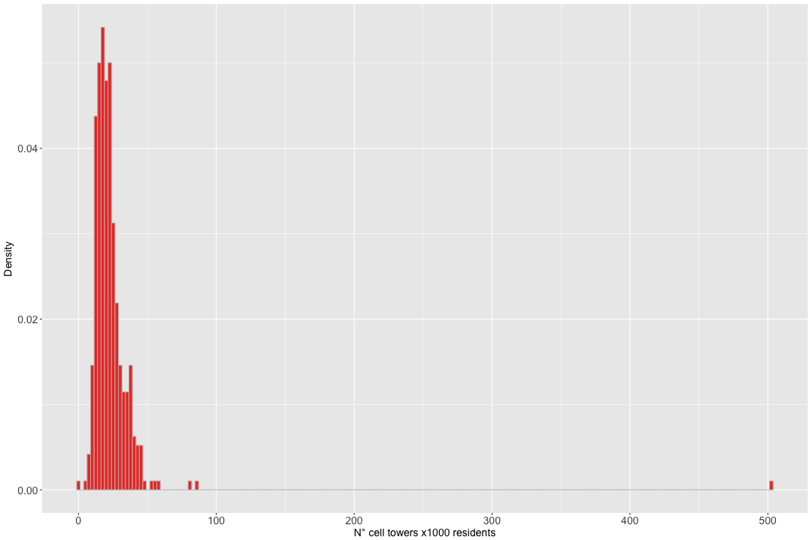
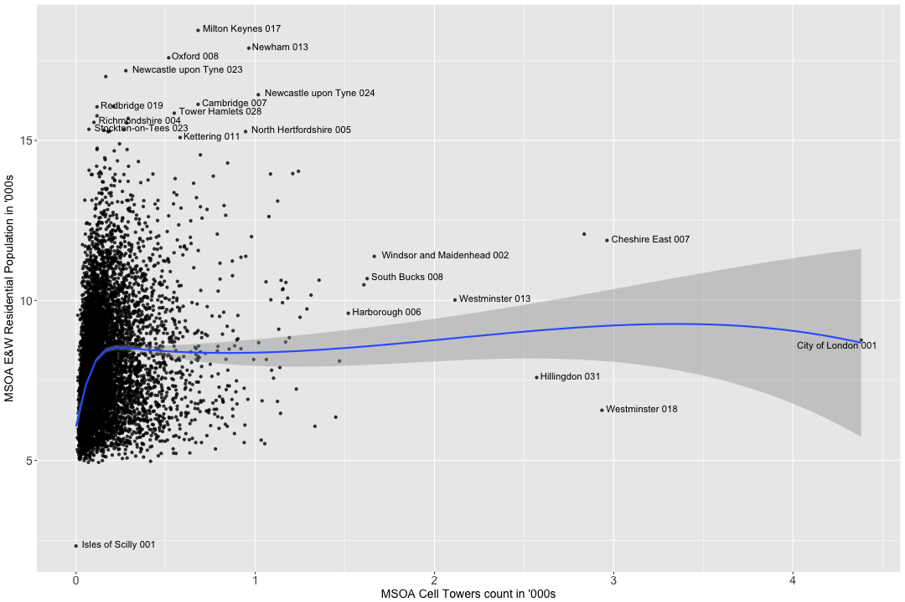
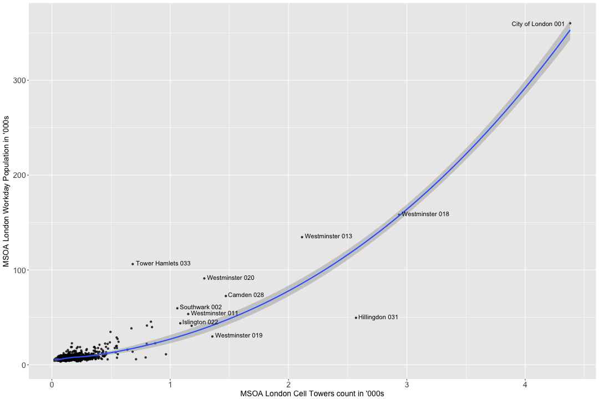
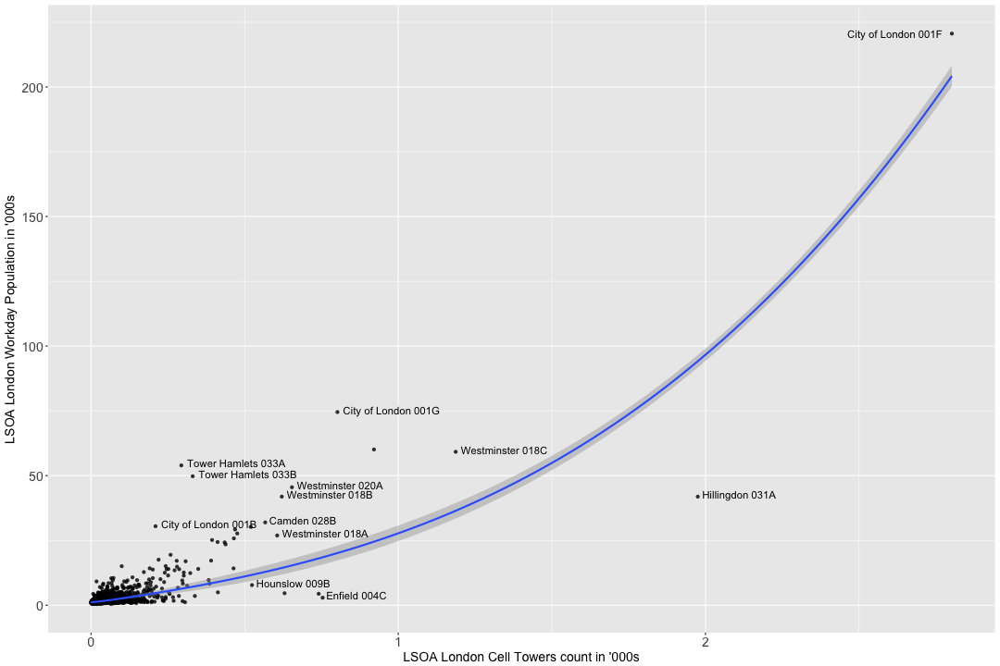

This notebook follows along the analysis produced for the publication *Comparing the density of mobile phone cell towers with population* part of the [ONS Methodology Working Paper Series]()

The relationship between official estimates of UK residential and [workday population](https://www.ons.gov.uk/peoplepopulationandcommunity/populationandmigration/populationestimates/articles/theworkdaypopulationofenglandandwales/2013-10-31#data)<sup>1</sup> density and the density of mobile phone cell-towers is investigated using freely available and open-sourced data on cell-tower locations from [OpenCellID](https://opencellid.org/).


## OpenCellID Data

The next table illustrates a snapshot of the OpenCellID database updated at 16 January 2017. 

Multiple GPS measurements referring to the same antenna are averaged to estimate its location more accurately. The main fields are: mobile technology (radio), mobile country code (mcc)<sup>2</sup>, mobile network (net), cell, longitude (lon), latitude (lat), range, samples (number of measurements), changeable (chg), created (timestamp of first measurement), updated (timestamp of last measurement). More detail on the definitions of these fields are in Appendix A of the publication.


```r
ct = read.table("data/cell_towers2017.csv", header = T, sep = ",", stringsAsFactors = F)
head(ct)
```

```
##    cell radio mcc net       lon      lat range samples changeable
## 1  3564   GSM 234  55 -1.891770 49.68383  6912      48          1
## 2  3505   GSM 234  55 -1.904799 49.68576  7083      34          1
## 3  3628   GSM 234  55 -1.846508 49.63674    24       3          1
## 4 40081   GSM 234  50 -1.942688 49.70964 19160      59          1
## 5 40220   GSM 234  50 -1.992018 49.70110 15596       5          1
## 6  3097   GSM 234  50 -1.938819 49.69829     0       1          1
##      created    updated
## 1 1309376492 1309376504
## 2 1309376492 1309376504
## 3 1309376492 1309376492
## 4 1309376502 1458857843
## 5 1309376502 1458857843
## 6 1309376502 1309376502
```

The number of cell-towers associated with UK MCCs and listed in the OpenCellID database as per date 16 January 2017 is 1,427,795.

## Analysis at Local Authority District (LAD) level 

The latitude and longitude coordinates of 1,382,999 cell-towers were mapped<sup>2</sup> into [2015 UK mainland LAD boundaries](http://geoportal.statistics.gov.uk/datasets?q=LAD%20Boundaries%202015&sort=name), the remaining 44,796 cell-towers being unallocated as they were based in Northern Ireland or their estimated position was in water around the UK coastline. 


```r
LAD = read.csv("data/LAD_UK.csv", header = T, sep = ",", stringsAsFactors = F)
LAD = mutate(LAD, 
       NP = NUMPOINTS / 1000,
       res = population_2015 / 1000,
       x_1000_res = NUMPOINTS/(population_2015/1000.0))
head(LAD)
```

```
##     LAD15CD              LAD15NM population_2015 NUMPOINTS wd_pop    NP
## 1 E06000001           Hartlepool           92493      1343  88452 1.343
## 2 E06000002        Middlesbrough          139509      1903 146734 1.903
## 3 E06000003 Redcar and Cleveland          135275      1327 124661 1.327
## 4 E06000004     Stockton-on-Tees          194803      3027 190810 3.027
## 5 E06000005           Darlington          105389      1706 108660 1.706
## 6 E06000006               Halton          126528      2765 125593 2.765
##       res x_1000_res
## 1  92.493  14.520018
## 2 139.509  13.640697
## 3 135.275   9.809647
## 4 194.803  15.538775
## 5 105.389  16.187648
## 6 126.528  21.852871
```

Using [2015 mid-year residential population estimates](https://www.ons.gov.uk/peoplepopulationandcommunity/populationandmigration/populationestimates/datasets/populationestimatesforukenglandandwalesscotlandandnorthernireland) for the UK mainland at LAD level, the next Figure shows a scatter plot of the count of cell-towers against residents. It shows that there is a reasonable approximately linear relationship as depicted by a [LOESS](https://en.wikipedia.org/wiki/Local_regression) regression line. The correlation is 0.84.


```r
#  Scatter plot of cell tower counts vs. residential population (LADs across UK mainland)
ggplot(LAD, aes(NP, res)) +
  geom_point(size = 2, alpha = 0.8, stroke= 0) + 
  geom_text(data=filter(LAD, res > 400 | NP > 10 | LAD15NM == "City of London"), aes(NP, res,label=LAD15NM), check_overlap = TRUE, hjust=-0.1, vjust=0, size = 4)+
  stat_smooth(method = 'loess') +
  xlab("LAD Cell Towers count in '000s") +
  ylab("LAD UK mainland Residential Population in '000s") 
```


Within LADs in England and Wales only, correlation between cell-tower density and residential population is 0.83 and with workday population is 0.86. 


```r
LAD_EN = LAD %>%  filter(grepl("E|W", LAD15CD))
head(LAD_EN)
```

```
##     LAD15CD              LAD15NM population_2015 NUMPOINTS wd_pop    NP
## 1 E06000001           Hartlepool           92493      1343  88452 1.343
## 2 E06000002        Middlesbrough          139509      1903 146734 1.903
## 3 E06000003 Redcar and Cleveland          135275      1327 124661 1.327
## 4 E06000004     Stockton-on-Tees          194803      3027 190810 3.027
## 5 E06000005           Darlington          105389      1706 108660 1.706
## 6 E06000006               Halton          126528      2765 125593 2.765
##       res x_1000_res
## 1  92.493  14.520018
## 2 139.509  13.640697
## 3 135.275   9.809647
## 4 194.803  15.538775
## 5 105.389  16.187648
## 6 126.528  21.852871
```


```r
# Corraletion between cell tower counts and Resiential population at Local Authority District Level (England and Wales only)
round(cor(LAD_EN$NUMPOINTS, LAD_EN$population_2015), 2) # 0.83
```

```
## [1] 0.83
```

```r
# Corraletion between cell tower counts and WorkDay population at Local Authority District Level (England and Wales only)
round(cor(LAD_EN$NUMPOINTS, LAD_EN$wd_pop), 2) # 0.86
```

```
## [1] 0.86
```

The next Figure shows the distribution across all LADs of the number of cell-towers per 1000 residents. The mean is around 23 cell towers per 1000 residents but there is one outlier having 502 cell towers in the City of London LAD, an area with a much larger workday population compared with its residential population.


```r
ggplot(LAD, aes(x_1000_res, y=..density..)) + 
  geom_histogram(stat = "bin", bins = 200, col="gray", 
                 fill="#ef3b2c") +
  ylab("Density") +
  xlab("N° cell towers x1000 residents") 
```




```r
# Summary Statistics
summary(LAD['x_1000_res'])
```

```
##    x_1000_res    
##  Min.   :  0.00  
##  1st Qu.: 15.56  
##  Median : 20.69  
##  Mean   : 23.64  
##  3rd Qu.: 26.24  
##  Max.   :502.51
```

In London and other areas around major urban LADs, it might be expected that the residential population is very different to the [workday population](https://www.ons.gov.uk/peoplepopulationandcommunity/populationandmigration/populationestimates/articles/theworkdaypopulationofenglandandwales/2013-10-31#data). Correlations were therefore run specifically for the 33 Greater London LADs. This revealed that the correlation between residential population and cell tower density in this region is very poor at 0.37 whilst by using workday population the correlation improves up to 0.91.  


```r
London_LAD = filter(LAD, grepl('E090000', LAD15CD))
head(London_LAD)
```

```
##     LAD15CD              LAD15NM population_2015 NUMPOINTS wd_pop    NP
## 1 E09000001       City of London            8760      4402 360075 4.402
## 2 E09000002 Barking and Dagenham          201979      3181 169117 3.181
## 3 E09000003               Barnet          379691      7636 314492 7.636
## 4 E09000004               Bexley          242142      3543 196519 3.543
## 5 E09000005                Brent          324012      6239 278874 6.239
## 6 E09000006              Bromley          324857      5513 269290 5.513
##       res x_1000_res
## 1   8.760  502.51142
## 2 201.979   15.74916
## 3 379.691   20.11109
## 4 242.142   14.63191
## 5 324.012   19.25546
## 6 324.857   16.97054
```


```r
# Corraletion between cell tower counts and Resiential population at Local Authority District Level (London only)
round(cor(London_LAD$NUMPOINTS, London_LAD$population_2015), 2) # 0.37
```

```
## [1] 0.37
```

```r
# Corraletion between cell tower counts and WorkDay population at Local Authority District Level (London only)
round(cor(London_LAD$NUMPOINTS, London_LAD$wd_pop), 2) # 0.91
```

```
## [1] 0.91
```


## Analysis at Middle Super Output Area (MSOA) level

For all cell-towers in England and Wales (1,262,507 in total), the latitude and longitude coordinates were mapped<sup>2</sup> into [MSOA boundaries](http://geoportal.statistics.gov.uk/datasets?q=MSOA_Boundaries_2011&sort=name). 


```r
# Number of cell towers per MSOA vs. number of residents per MSOA. England and Wales
MSOA_EW = read.csv("Data/MSOA_EW_wd_res_ct.csv", header = T, sep = ",", stringsAsFactors = F)
MSOA_EW = mutate(MSOA_EW, 
       NP = NUMPOINTS / 1000,
       res = mid_2015_res_pop / 1000,
       wd = wd_pop / 1000)
head(MSOA_EW)
```

```
##         MSOA11NM  MSOA11CD wd_pop NUMPOINTS mid_2015_res_pop    NP   res
## 1 Darlington 001 E02002559  15222       733             8900 0.733 8.900
## 2 Darlington 002 E02002560   3919        36             6276 0.036 6.276
## 3 Darlington 003 E02002561   3801        41             5506 0.041 5.506
## 4 Darlington 004 E02002562   4904        37             5947 0.037 5.947
## 5 Darlington 005 E02002563   4012        56             5393 0.056 5.393
## 6 Darlington 006 E02002564   6727        30             9572 0.030 9.572
##       wd
## 1 15.222
## 2  3.919
## 3  3.801
## 4  4.904
## 5  4.012
## 6  6.727
```

The next Figure shows that there is no linear relationship between cell-tower counts and residential population across MSOAs in England and Wales: the correlation is 0.18. 


```r
# Number of cell towers per MSOA vs. number of residents per MSOA. England and Wales
ggplot(MSOA_EW, aes(NP, res)) + 
  geom_point(size = 2, alpha = 0.8, stroke= 0) + 
  stat_smooth(method = "loess") +
  xlab("MSOA Cell Towers count in '000s") +
  ylab("MSOA E&W Residential Population in '000s") +
  geom_text(data=filter(MSOA_EW, res > 15 | (NP > 1.5 & NP < 4)),
            aes(NP, res,label=MSOA11NM), check_overlap = TRUE, hjust=-0.06, vjust=0.2, size = 4)+
  geom_text(data=filter(MSOA_EW, NP > 4),
            aes(NP, res,label=MSOA11NM), check_overlap = TRUE,hjust=0.8, vjust=1.2, size = 4)+
  geom_text(data=filter(MSOA_EW, res < 3),
            aes(NP, res,label=MSOA11NM), check_overlap = TRUE,hjust=-0.08, vjust=0.2, size = 4)
```




```r
# Corraletion between cell tower counts and Resiential population at MSOA Level (England & Wales)
round(cor(MSOA_EW$NUMPOINTS, MSOA_EW$mid_2015_res_pop),2) # 0.18
```

```
## [1] 0.18
```


Although workday population is better correlated with cell-tower counts, this correlation is still weak at 0.51.


```r
# Number of cell towers per MSOA vs. number of workday population per MSOA. England and Wales
ggplot(MSOA_EW, aes(NP, wd)) + 
  geom_point(size = 2, alpha = 0.8, stroke= 0) + 
  stat_smooth(method = "loess") +
  xlab("MSOA Cell Towers count in '000s") +
  ylab("MSOA E&W Workday Population in '000s") +
  geom_text(data=filter(MSOA_EW, (wd > 80 & wd < 300) | (NP > 1.5 & NP < 4)),
            aes(NP, wd,label=MSOA11NM), check_overlap = TRUE, hjust=-0.06, vjust=0.2, size = 4)+
  geom_text(data=filter(MSOA_EW, NP > 4),
            aes(NP, wd,label=MSOA11NM), check_overlap = TRUE,hjust=1.1, size = 4)
```


```r
# Corraletion between cell tower counts and WorkDay population at Local Authority District Level (London only)
round(cor(MSOA_EW$NUMPOINTS, MSOA_EW$wd_pop), 2) # 0.51
```

```
## [1] 0.51
```

The poor correlation between population density and cell tower density across the country is possibly due to the siting of large numbers of cell towers on major transport routes, typically in areas of low population density, as in Eden LAD identified above.

A high population density exists across the whole Greater London area and even though there are still main transport routes, these will similarly run through areas of high population density. Using the workday population for London MSOAs only, the next Figure shows that the correlation with cell towers is a respectable 0.86 compared against a correlation of only 0.15 with 2015 residential population. 


```r
# London MSOAs
MSOAs_L = read.table("lookups/MSOA_London.txt", header = F)
MSOA_London = filter(MSOA_EW, MSOA11CD %in% MSOAs_L$V1)
head(MSOA_London)
```

```
##     MSOA11NM  MSOA11CD wd_pop NUMPOINTS mid_2015_res_pop    NP   res    wd
## 1 Camden 001 E02000166   7082       288             8554 0.288 8.554 7.082
## 2 Camden 002 E02000167   7453       341             8596 0.341 8.596 7.453
## 3 Camden 003 E02000168   9209       185             9000 0.185 9.000 9.209
## 4 Camden 004 E02000169   6140       203             8524 0.203 8.524 6.140
## 5 Camden 005 E02000170   5615       124             9127 0.124 9.127 5.615
## 6 Camden 006 E02000171   5900        92             8667 0.092 8.667 5.900
```


```r
ggplot(MSOA_London, aes(NP, wd)) + geom_point(size = 2, alpha = 0.8, stroke= 0) + stat_smooth(method = "loess") +
  xlab("MSOA London Cell Towers count in '000s") +
  ylab("MSOA London Workday Population in '000s") +
  geom_text(data=subset(MSOA_London, (wd > 100 & wd < 300) | (NP > 1 & NP < 4)),
            aes(NP, wd,label=MSOA11NM), 
            check_overlap = TRUE, hjust=-0.06, vjust=0.2, size = 4) +
  geom_text(data=subset(MSOA_London, NP > 4),
            aes(NP, wd,label=MSOA11NM), check_overlap = TRUE,hjust=1.1, size = 4)
```




```
## [1] 0.15
```

```
## [1] 0.86
```

## Analysis for Lower Super Output Areas (LSOAs) in London only

Since the distortion caused by transport routes may not be as pronounced in London, a more focussed analysis was conducted in this region to see if correlations between cell towers and population density might be good at even smaller geographies, such as LSOA.


```r
LSOA_London = read.csv("data/LSOA_London_wd_res_ct.csv", header = T, sep = ",", stringsAsFactors = F)
LSOA_London = mutate(LSOA_London, 
       NP = NUMPOINTS / 1000,
       res = mid_2015_res_pop / 1000,
       wd = wd_pop / 1000)
head(LSOA_London)
```

```
##    LSOA11CD                  LSOA11NM NUMPOINTS wd_pop mid_2015_res_pop
## 1 E01000001       City of London 001A       272  13465             1639
## 2 E01000002       City of London 001B       210  30461             1412
## 3 E01000003       City of London 001C        35   1561             1698
## 4 E01000005       City of London 001E       259  19450             1503
## 5 E01000006 Barking and Dagenham 016A        30   1172             1868
## 6 E01000007 Barking and Dagenham 015A        73   2405             2142
##      NP   res     wd
## 1 0.272 1.639 13.465
## 2 0.210 1.412 30.461
## 3 0.035 1.698  1.561
## 4 0.259 1.503 19.450
## 5 0.030 1.868  1.172
## 6 0.073 2.142  2.405
```


```r
ggplot(LSOA_London, aes(NP, wd)) + 
  geom_point(size = 2, alpha = 0.8, stroke= 0) + 
  stat_smooth(method = "loess") +
  xlab("LSOA London Cell Towers count in '000s") +
  ylab("LSOA London Workday Population in '000s") +
  geom_text(data=subset(LSOA_London, (wd > 30 & wd < 200) | (NP > 0.5 & NP < 2.5)),
            aes(NP, wd, label=LSOA11NM), 
            check_overlap = TRUE,  hjust=-0.06, vjust=0.2, size = 4) +
  geom_text(data=subset(LSOA_London, NP > 2.5),
            aes(NP, wd, label=LSOA11NM), check_overlap = TRUE, hjust=1.1, size = 4)
```



Correlation with cell tower density across London LSOAs remains high at 0.82. This compares with 0.14 for similar correlation with residential population, indicating that cell towers are more likely to be positioned to cater for the expected peak demand for mobile telephony which, in London, are more likely to arise from populations present during the workday.


```r
# Corraletion between cell tower counts and Resiential population at LSOA Level (London only)
round(cor(LSOA_London$NUMPOINTS, LSOA_London$mid_2015_res_pop), 2) # 0.14
```

```
## [1] 0.14
```

```r
# Corraletion between cell tower counts and WorkDay population at LSOA Level (London only)
round(cor(LSOA_London$NUMPOINTS, LSOA_London$wd_pop), 2) # 0.82
```

```
## [1] 0.82
```

---

<sup>1</sup> Based on Census 2011

<sup>2</sup> A [mobile country code (MCC)](https://en.wikipedia.org/wiki/Mobile_country_code?oldformat=true) is used in combination with a mobile network code (MNC) to uniquely identify an MNO. The MCCs associated with the UK are 234 and 235.

<sup>2</sup> All the mapping of cell-towers to the geographical boundaries has been achieved using [QGIS 2.18.2](http://qgis.osgeo.org) Quantum GIS Geographic Information System. Open Source Geospatial Foundation Project. 
