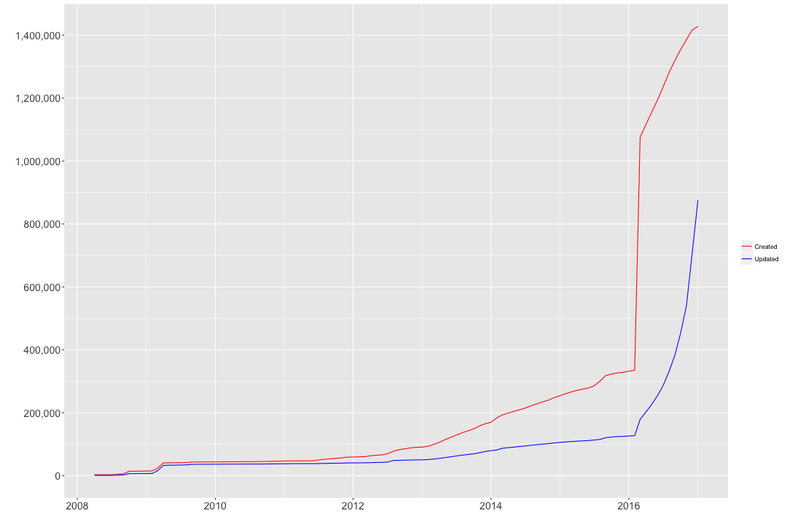
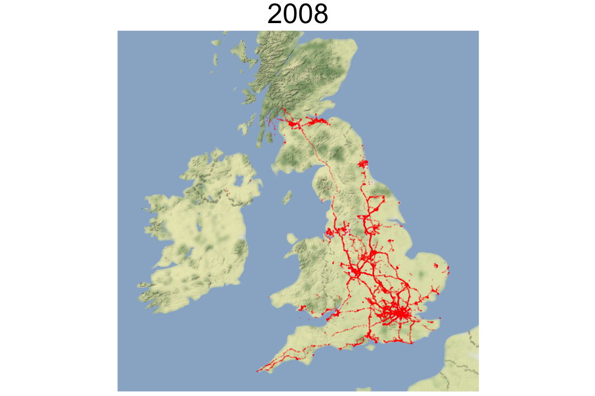
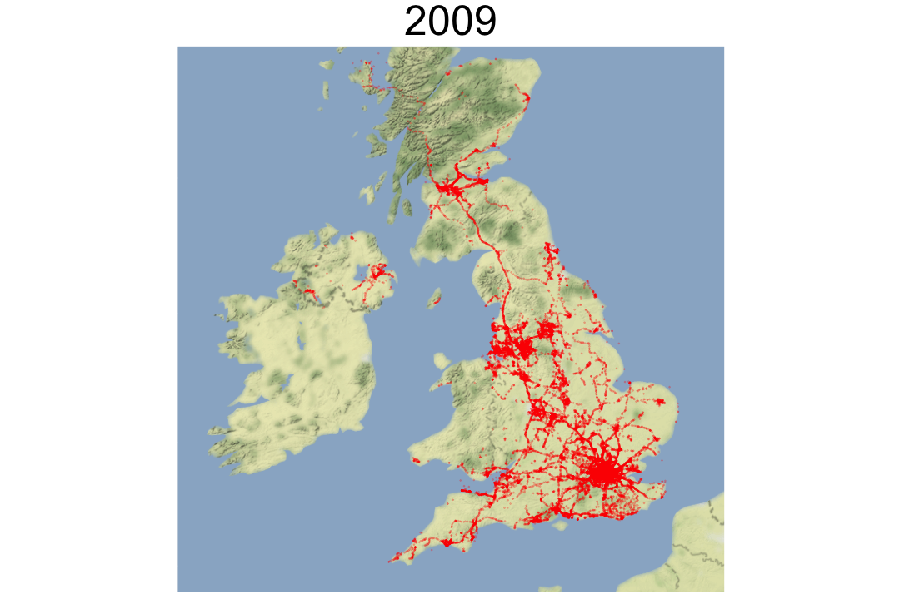
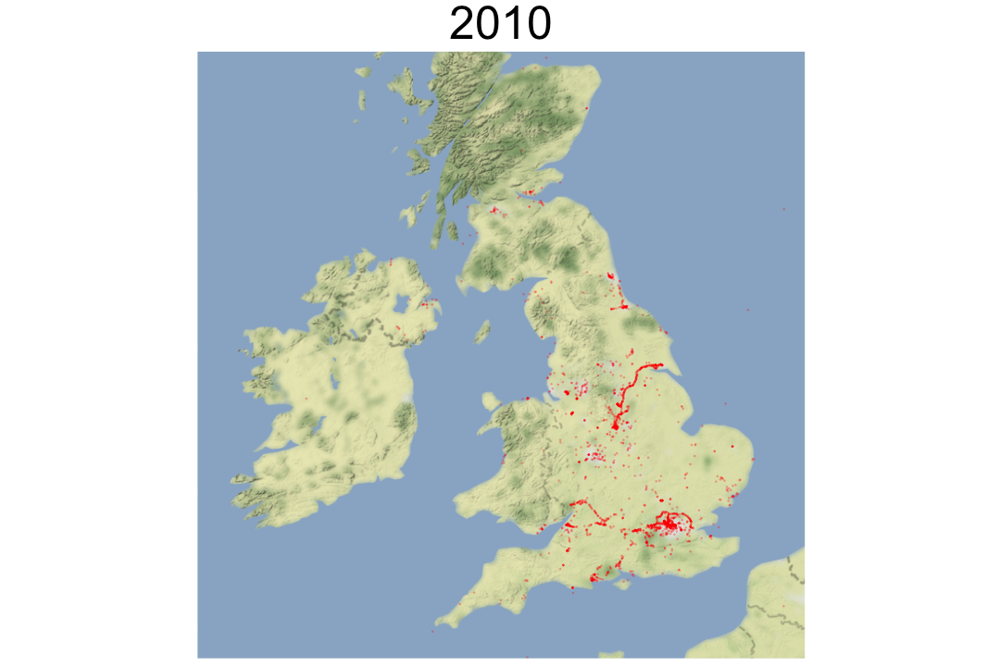
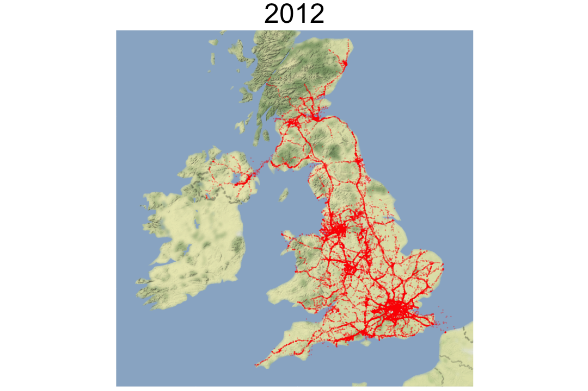
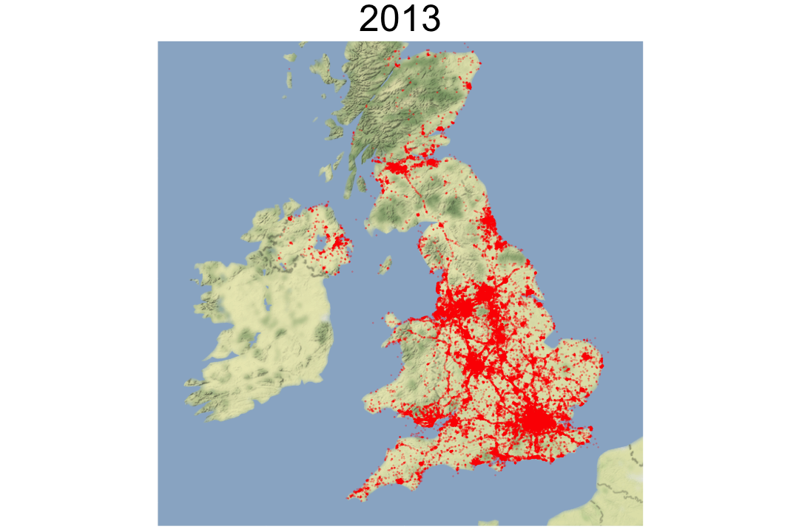
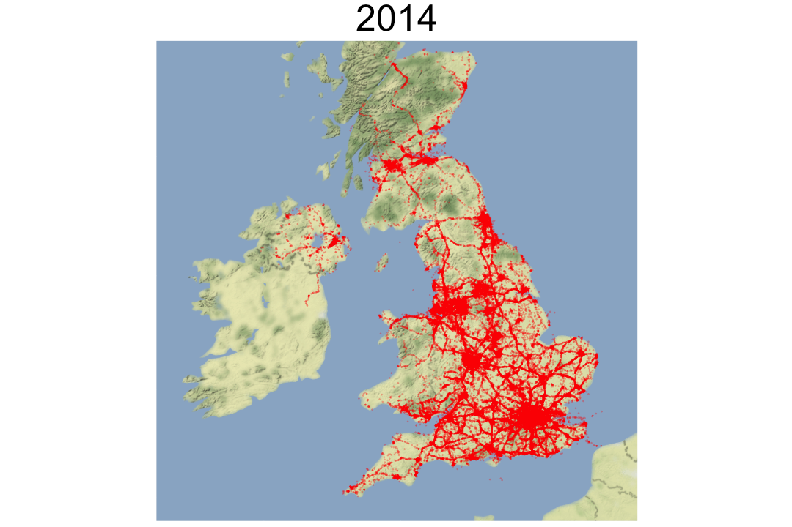
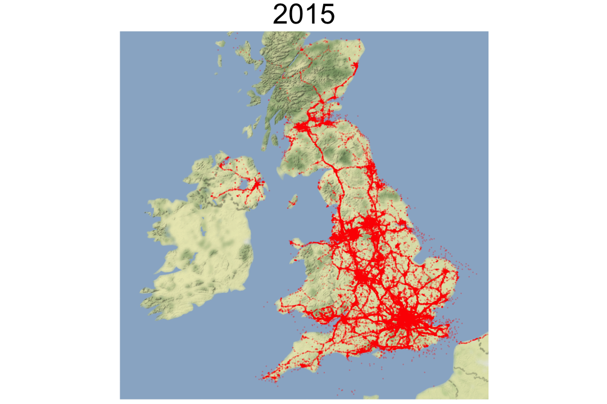
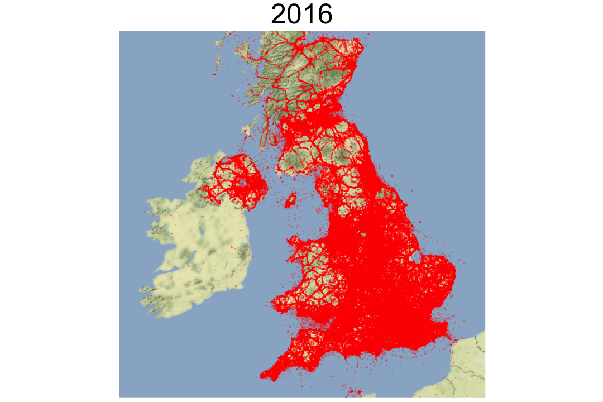

This notebook follows along the APPENDIX B produced for the publication *Comparing the density of mobile phone cell towers with population* part of the [ONS Methodology Working Paper Series]()

The relationship between official estimates of UK residential and [workday population](https://www.ons.gov.uk/peoplepopulationandcommunity/populationandmigration/populationestimates/articles/theworkdaypopulationofenglandandwales/2013-10-31#data)<sup>1</sup> density and the density of mobile phone cell-towers is investigated using freely available and open-sourced data on cell-tower locations from [OpenCellID](https://opencellid.org/).


Each cell tower in the OpenCellID database has a timestamp representing the date/time the cell tower was first registered and the latest measurement. 

Data from the OpenCellID database was retrieved for research on the 16 January 2017.


```r
head(ct)
```

```
##    cell radio mcc net       lon      lat range samples changeable
## 1  3564   GSM 234  55 -1.891770 49.68383  6912      48          1
## 2  3505   GSM 234  55 -1.904799 49.68576  7083      34          1
## 3  3628   GSM 234  55 -1.846508 49.63674    24       3          1
## 4 40081   GSM 234  50 -1.942688 49.70964 19160      59          1
## 5 40220   GSM 234  50 -1.992018 49.70110 15596       5          1
## 6  3097   GSM 234  50 -1.938819 49.69829     0       1          1
##      created    updated
## 1 1309376492 1309376504
## 2 1309376492 1309376504
## 3 1309376492 1309376492
## 4 1309376502 1458857843
## 5 1309376502 1458857843
## 6 1309376502 1309376502
```

The next figure highlights the cumulative number of how many cell towers per month have been created (inserted for the first time in the database) and updated (excluding those cell towers with no update) up to January 2017.


```r
new_ct = ct %>% 
  mutate( c_date = monthStart(created),
          u_date = monthStart(updated))
by_create = count(new_ct, c_date)
by_update = new_ct %>% group_by(u_date) %>% summarise(n = length(cell[samples > 1]))
```


```r
cumsummed = by_create %>% 
  full_join(by_update, 
            by = c("c_date" = "u_date"), 
            suffix = c(".created", ".updated")) %>%
  arrange(c_date) %>%
  mutate(cum_created = cumsum(n.created), 
         cum_updated = cumsum(n.updated)) %>%
  select(c_date, cum_created, cum_updated)

melted = melt(cumsummed, id = "c_date")
ggplot(melted, aes(x = c_date, y = value, colour = variable, group = variable)) + 
  geom_line() +
  xlab("") + ylab("") +
  scale_y_continuous(labels = scales::comma, breaks = seq(0, 1600000, 200000)) +
  scale_color_manual(labels =  c("Created", "Updated"), values = c("red", "blue")) + 
  theme(legend.title = element_blank())
```




The chart highlights that the registering and updating of cell towers has become more active in the past year. This may be related to the expansion of smartphone applications such as [inViu OpenCellID](http://wiki.opencellid.org/wiki/Data_sources) and [OCI4BB](https://sourceforge.net/projects/oci4bb/), which make it easier to contribute.

The month with the highest pick of new cell towers registered is March 2016, with 740,123 new cell towers, that is half of the whole dataset has been generated on that month. A relatively similar sudden change on the number of new cell towers registered is seen in April 2009, where again the size of the database has increase from 23,891 to 40,520 cell towers (+70% increase).

## New cell towers per year

For each year from 2008 to 2016 all newly registered cell towers were plotted<sup>2</sup>, using the latitude and longitude points on the UK map. This reveals that cell towers are positioned along main transport routes across the UK as well as in major urban centres.


```r
new_ct = new_ct %>% 
  mutate( year = format(c_date, "%Y"))
```


```r
plor_year(2008, new_ct)
```



```r
plor_year(2009, new_ct)
```




```r
plor_year(2010, new_ct)
```




```r
plor_year(2011, new_ct)
```


```r
plor_year(2012, new_ct)
```




```r
plor_year(2013, new_ct)
```




```r
plor_year(2014, new_ct)
```




```r
plor_year(2015, new_ct)
```




```r
plor_year(2016, new_ct)
```



In the 2015 and 2016 maps there are a small number of cell towers positioned at sea. These could represent cell towers close to the coast that are connected to on journeys across water. The GPS signal sent to OpenCellID will be that representing the mobile user’s exact position. Another possibility, is that ferries/ships started to have their own cell tower/antennae or that contributors to OpenCellID have just made an observation of these cell-towers.   

---

<sup>1</sup> Based on Census 2011

<sup>2</sup> D. Kahle and H. Wickham. ggmap: Spatial Visualization with ggplot2. The R Journal,
  5(1), 144-161. URL http://journal.r-project.org/archive/2013-1/kahle-wickham.pdf


